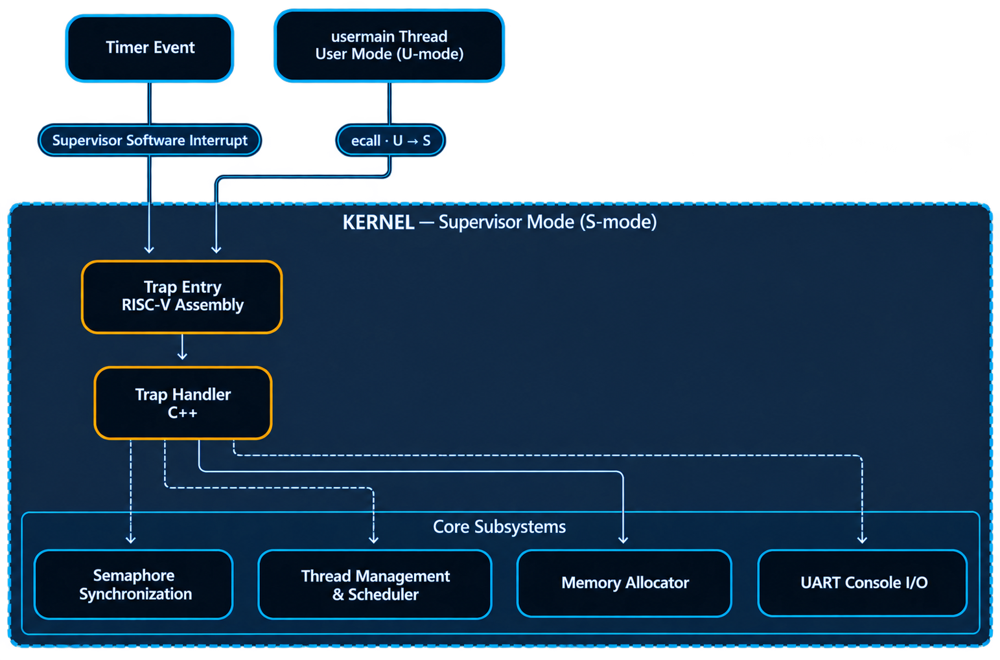

# RISC-V Multithreaded Operating System

[](https://github.com/)
[](https://github.com/)
[](https://github.com/)
[](https://github.com/)

A multithreaded operating system kernel written in C++ and RISC-V assembly, developed as part of a university Operating Systems project.

The project implements kernel-level thread management, preemptive scheduling, memory allocation, semaphore-based synchronization, system calls, and buffered console I/O.

## Architecture


<p align="center">
  
</p>


## Features

- **Thread management** — Thread creation, termination, dispatching, and sleeping.
- **Preemptive scheduling** — Timer-driven interrupts enable asynchronous scheduling and context switching between threads.
- **Memory allocation** — A custom best-fit allocator with free-block coalescing and allocation metadata.
- **Semaphore synchronization** — Blocking synchronization primitives with support for signaling one or multiple units and waking eligible waiting threads.
- **System call interface** — Kernel services exposed through `ecall` and a shared trap-handling mechanism.
- **Console I/O** — UART-based input and output using circular buffers, interrupt-driven input handling, and a dedicated output thread.
- **C and C++ interfaces** — Kernel functionality exposed through the interfaces defined by the project specification.

## Implementation Details

### Thread Management and Scheduling

The kernel manages multiple threads and supports both explicit dispatching and timer-driven preemption.

Thread context information is maintained through the thread control block (TCB), including the return address (`ra`) and stack pointer (`sp`). Context switching uses the provided low-level assembly routine together with the kernel's thread-management logic.

Threads can terminate upon completion, and sleeping threads can block for a specified period.

### Memory Allocator

A custom best-fit memory allocator manages dynamically allocated memory.

The allocator maintains block metadata, including allocation state, a magic value, and linked-list pointers. It supports coalescing adjacent free blocks to reduce fragmentation.

### Synchronization

Semaphore operations support blocking threads until the requested resources become available.

The signaling operations can increase the semaphore count by one or by an arbitrary number of units. Waiting threads are tracked in a linked list, and signaling wakes threads whose resource requirements can be satisfied.

### Trap Handling and System Calls

System calls are invoked using the RISC-V `ecall` instruction. The kernel uses a common trap handler to process system calls and relevant interrupts.

Timer interrupts are forwarded to the kernel as supervisor-mode software interrupts, allowing the kernel to handle timer-driven scheduling through its trap mechanism.

### Console I/O

Console input and output use UART registers and circular buffers.

Incoming keyboard data is handled through interrupt-driven input processing. A dedicated thread drains the output buffer and sends data to the console.

## Testing

The project was validated using the public tests provided for the university project.

In addition, I independently performed a stress test using the producer–consumer workload:

- 800 producer threads and one consumer thread.
- A small shared buffer with a capacity of approximately 10–100 elements.
- Random keyboard input while the workload was running.
- The kernel remained stable and did not crash during the test.

## Build and Run

Run the project in QEMU using:

```bash
make qemu
```
